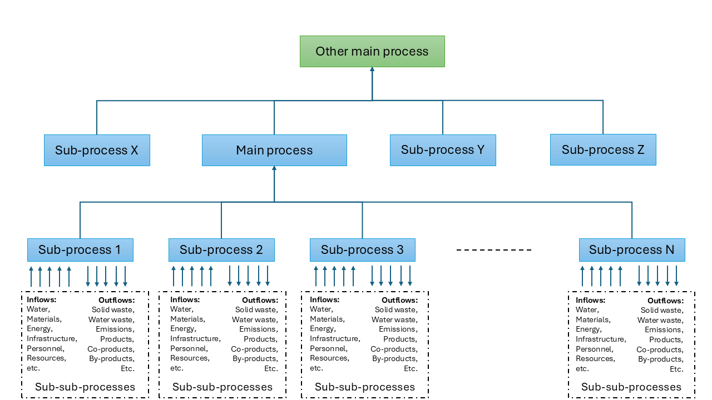

# LcPy

# Documentation
A detailed user documentation and guide is available here: * [General Documentation](https://github.com/spirdgk/lcpy/blob/master/General%20documentation.pdf)

A Python package for flexible, parametric LCA and LCC calculations. LcPy aims on enabling dynamic and advanced environmental and costing assessment for processes and systems. 
The user is prompted to define in a structured way a process consisting of several construction and operational sub-processes. The user then associates each sub-process to the consumption of 
inflows and production of outflows (sub-sub-processes). The user can include the amounts of inflows and outflows of each sub-process via parametric models that calculate these exchange amounts 
for various scenarios and in-time, as precalculated 2-D numpy arrays, or as simple scalar values. Depending on the way of modelling the different functions are provided to calculate the LCA 
and LCC while considering the time-parameter, uncertainty or explore scenarios. A bw2 environment, project and database loaded with an ecoinvent copy need to be available in a separate local 
folder to be used by LcPy to derive the unit impacts of the sub-processes. Alternatively the user can inputr externally calculated unit impacts for the sub-processes.

The steps to utilize LcPy for LCA analysis are

- Define the main process to be assessed, the sub-processes it includes and the sub-sub-processes these involve.
- Determine the amounts of sub-sub-processes needed in each sub-process and the amount of each sub-process needed by the main process by
  - Modelling them as simple scalar values (simple LCA)
  - Modelling them as numpy arrays 2-D precalculated from a parametric/data-driven/simulation model
  - Using a parametric/data-driven/simulation model to calculate them on the fly
- Define the names of each sub-process and sub-sub-process
- Identify the bw keys pointing to the processes in the bw project that model for the sub-sub-processes to extract the impact factors using a selected LCIA method 
- Structure the exchange amounts, sub-process and sub-sub-processes names, and bw keys in dictionaries and lists modelling for each sub-process and the main process
- Perform some restructuring of the information to enable its use (following the examples, documentation, and using LcPy functions)
- Load, or calculate as described in the documentation dynamic characterization factors for the desired time horizon of the analysis (for the fully-dynamic LCA)
- Follow the examples to calculate and visualize LCA results for static and dynamic LCA including or not uncertainty and multiple scenarios

The steps to utilize LcPy for LCC/TEA analysis are

- Define the main process to be assessed, the sub-processes it includes and the sub-sub-processes these involve.
- Determine the amounts of sub-sub-processes needed in each sub-process and the amount of each sub-process needed by the main process by
  - Modelling them as simple scalar values
  - Modelling them as numpy arrays 2-D precalculated from a parametric/data-driven/simulation model
  - Using a parametric/data-driven/simulation model to calculate them on the fly
- Define the names of each sub-process and sub-sub-process
- Identify the cost/revenue generated by each unit amount of sub-sub-process and multiply with the respective exchange amounts
- Structure the exchange costs/revenues, sub-process and sub-sub-processes names, in dictionaries and lists modelling for each sub-process and the main process
- Perform some restructuring of the information to enable its use (following the examples, documentation, and using LcPy functions)
- Follow the examples to calculate and visualize LCC and TEA results

## Installation

LcPy is under active development and can be installed by cloning the repository or via

pip install git+https://github.com/spirdgk/lcpy.git

## Examples

Please consult the documentation and follow the examples provided to use the package. In order to use in combination with bw2 please install a bw2 environment in a separate folder and 
pass the path to it and related information to the structured dictionary as described in the examples.

If you're using the package please consider citing the following pre-print article
Spiros Gkousis, Evina Katsou, lcpy: an open-source python package for parametric and dynamic Life Cycle Assessment and Life Cycle Costing, arXiv, June 2025, https://doi.org/10.48550/arXiv.2506.13744

## Requirements

See requirements.txt

## Contributions

Any contributions are welcomed.

## Contributors

 * [Spyridon Gkousis](https://github.com/spirdgk)

## Acknowledgments

 * [SAFELOOP project](https://www.safeloop.eu/)

## License

BSD 3-Clause License
